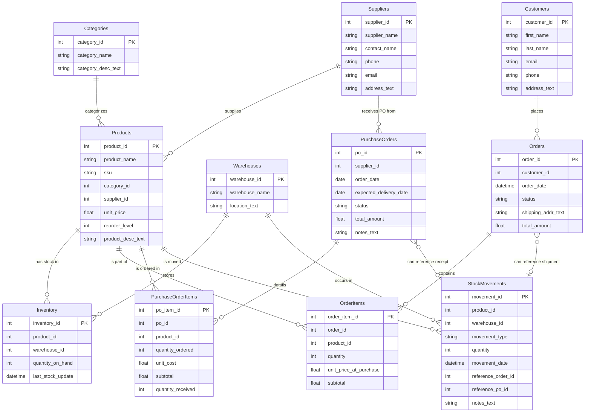

```mermaid
erDiagram
    Suppliers {
        int supplier_id PK
        string supplier_name
        string contact_name
        string phone
        string email
        string address_text
    }
    Categories {
        int category_id PK
        string category_name
        string category_desc_text
    }
    Products {
        int product_id PK
        string product_name
        string sku
        int category_id
        int supplier_id
        float unit_price
        int reorder_level
        string product_desc_text
    }
    Warehouses {
        int warehouse_id PK
        string warehouse_name
        string location_text
    }
    Inventory {
        int inventory_id PK
        int product_id
        int warehouse_id
        int quantity_on_hand
        datetime last_stock_update
    }
    Customers {
        int customer_id PK
        string first_name
        string last_name
        string email
        string phone
        string address_text
    }
    Orders {
        int order_id PK
        int customer_id
        datetime order_date
        string status
        string shipping_addr_text
        float total_amount
    }
    OrderItems {
        int order_item_id PK
        int order_id
        int product_id
        int quantity
        float unit_price_at_purchase
        float subtotal
    }
    PurchaseOrders {
        int po_id PK
        int supplier_id
        date order_date
        date expected_delivery_date
        string status
        float total_amount
        string notes_text
    }
    PurchaseOrderItems {
        int po_item_id PK
        int po_id
        int product_id
        int quantity_ordered
        float unit_cost
        float subtotal
        int quantity_received
    }
    StockMovements {
        int movement_id PK
        int product_id
        int warehouse_id
        string movement_type
        int quantity
        datetime movement_date
        int reference_order_id
        int reference_po_id
        string notes_text
    }

    Suppliers ||--o{ Products : "supplies"
    Categories ||--o{ Products : "categorizes"
    Products ||--o{ Inventory : "has stock in"
    Warehouses ||--o{ Inventory : "stores"
    Customers ||--o{ Orders : "places"
    Orders ||--o{ OrderItems : "contains"
    Products ||--o{ OrderItems : "is part of"
    Suppliers ||--o{ PurchaseOrders : "receives PO from"
    PurchaseOrders ||--o{ PurchaseOrderItems : "details"
    Products ||--o{ PurchaseOrderItems : "is ordered in"
    Products ||--o{ StockMovements : "is moved"
    Warehouses ||--o{ StockMovements : "occurs in"
    Orders }o--o| StockMovements : "can reference shipment"
    PurchaseOrders }o--o| StockMovements : "can reference receipt"
```
